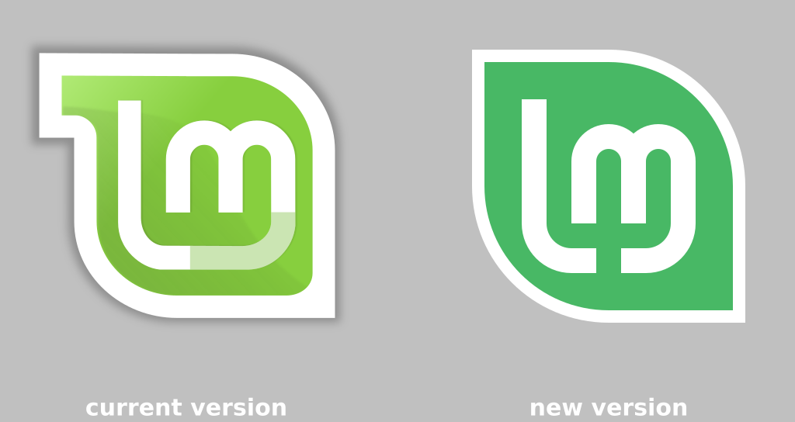

## My first logo proposal

This was done in October 2018. As seen on:  
[VOTE! Mint-Y-LOGO... A New Version Of The Linux Mint Logo!](Https://forums.linuxmint.com/viewtopic.php?f=19&t=280401)

SVG source:  
[Mint-Y-logo-02.svg](Mint-Y-logo-02.svg)

**This Mint-Y-logo-02.svg is exactly the same design as the one proposed on the LinuxMint forum on October 2018.** But it got re-edited on 2022-04-16 for technical purposes. The design is still exactly the same, pixel-by-pixel, but the SVG coding behind the scene is now made much more simple, clear, and fast.

**changelog 2022-04-16:**  
  * delete layers
  * ungroup
  * convert stroke to path
  * path union
  * no transforms
  * edit metadata
  * save as plain svg