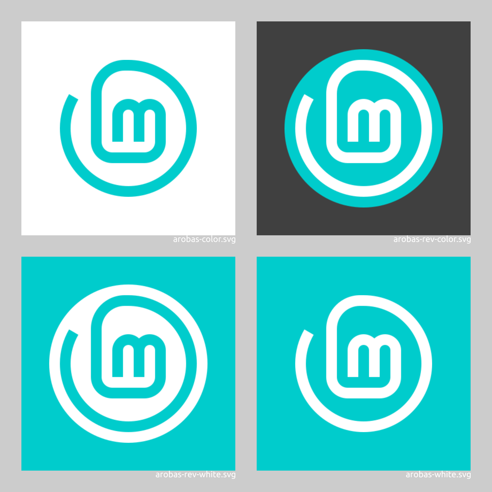

# LinuxMint logo and brand resources (unofficial)

### Save as Plain SVG and use pixels (px) as units

All these files are saved as plain SVG (Inkscape > File > Save As... Plain SVG). This makes the files smaller without loosing any important data. Except one information: all units are in pixels. Everything was made using round numbers here. There is no such thing as `x=1.234 px` anywhere here. Prior to doing any edit, please set your document and tool units to pixels and use only round numbers.

### Why do i keep changing the logo again and again ?

I kept changing the logo again and again, trying new versions, because i was not satisfied. And because all my past propositions got rejected. I think i finally have created a good one: this arobas-green.svg and all the other arobas* variants. I would be very surprised these arobas* logos would be officially approved, but at least now i can say i tried, and now i can just forget this. I lost a big part of my summer into this. (You can also find some of the early ones in the [alternatives](alternatives) directory.)

What is a good logo? A good logo has some meaning, carries some values, in an obvious or hidden manner. And these symbols and values should correspond to the entity the logo represents, of course. That is what logo design is all about. And this logo must be simple, to be quickly recognizable even when printed small or seen from far. And, of course, it must be technically well done, mastered. Well, the old LinuxMint logo from 2007 had none of these requirements. To sum up, this old logo from 2007 is... old, it doesn't look like a leaf, in fact it doesn't look like anything, and it does not carry any values, and all the alignments and spacings are bad, and the colour is bad, and the subtle gradient in there is just a rough drawing. And, technically, the SVG file is messy and the font looks like some vectored image scan... It is just... ugly.

Sorry for being so rude, but here I am saying what I kept to myself since October 2018, when I proposed a new version, a completely redrawn logo. I didn't want to hurt anyone at that time. But now... well, I still don't want to hurt the original creator. He did this for free, and, back in year 2007, I am not sure I would have done any better, really. But now... we are getting near year 2022 and I still see this old 2007 logo everywhere, or almost, so I am starting to get a bit upset... Well, at least I still try to keep my thoughts hiding here on GitHub, not spreading it everywhere on the Mint forums.

So, i tried to create a new one. I had one that i thought was pretty good, back in 2018, but it never made it to the official repositories. So, i kept searching. I have created a few good logos. This one here on the front page, and a few other ones that you can find in the sub-directories. But the LinuxMint team will not take them, because they already have about a dozen of logos available on https://github.com/linuxmint/brand-logo. But this is precisely one of the main disputes I have with the Mint team. In my humble opinion, there should be just one logo, with a few similar variants for colors and with or without the full name. Just one logo. Not twelve. Just one logo, but preferably, a good one.

### Color

I sincerely, really don't like the current official Mint logo color: #86BE43. This 87° hue is a yellow-green. This could be nice, when pure, but this is one of the brightest colors. So, it must be heavily subdued. And then it doesn't look nice at all. This #86BE43 is some kind of grayish yellowish green. Some kind of khaki green. The LinuxMint team wants to avoid pure green. Or forest green. I understand and agree with that. But then, I suggest moving into much higher hues, such as over 160°. I found this "Mint Leaf" color on https://flatuicolors.com/palette/us. This: #00B894. That's much better. I still keep searching for new colors.
