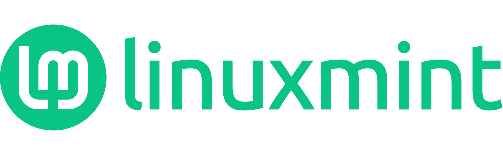

## LINUXMINT LOGO design experiments

---

---

---

---

### Download them all into a small ZIP

* Click on the green **Code** button on the top-right ↗ of the main page and then **Download ZIP.**
* Or click this: [download ZIP](https://github.com/SebastJava/linuxmint-logo/archive/refs/heads/master.zip).

### Why do i keep changing the logo again and again ?

I kept changing the logo again and again, trying new versions, because i was not satisfied. And because all my past propositions got rejected. I think i finally have created one or two good ones: this trident version or this other arobas version and their variants. I would be very surprised these new logos would be officially approved, but at least now i can say i tried, and now i can just forget this.

What is a good logo? A good logo has some meaning, carries some values, in an obvious or hidden manner. And these symbols and values should correspond to the entity the logo represents, of course. That is what logo design is all about. And this logo must be simple, to be quickly recognizable even when printed small or seen from far. And, of course, it must be technically well done, mastered. Well, the old LinuxMint logo from 2007 had none of these requirements. To sum up, this old logo from 2007 is... old, it doesn't look like a leaf, in fact it doesn't look like anything, and it does not carry any values, and all the alignments and spacings are bad, and the colour is bad, and the subtle gradient in there is just a rough drawing. And, technically, the SVG file is messy and the font looks like some vectored image scan... It is just... ugly.

Sorry for being so rude, but here I am saying what I kept to myself since October 2018, when I proposed a new version, a completely redrawn logo. I didn't want to hurt anyone at that time. But now... well, I still don't want to hurt the original creator. He did this for free, and, back in year 2007, I am not sure I would have done any better, really. But now... we are getting near year 2022 and I still see this old 2007 logo everywhere, or almost, so I am starting to get a bit upset... Well, at least I still try to keep my thoughts hiding here on GitHub, not spreading it everywhere on the Mint forums.

So, i tried to create a new one. I had one that i thought was pretty good, back in 2018, but it never made it to the official repositories. So, i kept searching. I have created two or three good logos. But the LinuxMint team will not take them, because they already have about a dozen of logos available on https://github.com/linuxmint/brand-logo. But this is precisely one of the main disputes I have with the Mint team. In my humble opinion, there should be just one logo, with a few similar variants for colors and with or without the full name. Just one logo. Not twelve. Just one logo... But, preferably, a good one.

### History

What follows is my version of the story, of course. And i am trying to make it a short story.

A competition was held to define the Linux Mint logo. The logo proposed by Carlos Porto won the vote. That was back in year 2007. Ten years later, I installed Linux Mint on my little Netbook. I didn't like the logo that appeared on my screen. There was too many details and I didn't find much sense in it.

I set out to redraw this logo from scratch, on a blank page, forgetting all those annoying details. I've searched the web and saw others have tried it before me. So I have the idea to share my creation. I'm afraid I won't be accepted so I set out to redo a logo similar to the official logo, but in a simple and flat version: [2018-poll](2018-poll) I present this on the LM forums: [VOTE! Mint-Y-LOGO... A New Version Of The Linux Mint Logo!](Https://forums.linuxmint.com/viewtopic.php?f=19&t=280401)

In the comments received, among those that are positive, Reaccion Raul suggested a simpler background, if any, or just the "Lm". And then Joan_2018 suggested doing that in black and white, without colors. And then, later, Clem presented us with a simplified logo with different backgrounds, mostly circular background shapes. So this logo is the result of a collective work, in my humble opinion. I'm glad Clem went further than me, completely forgetting the old background. I approve and continue on this path, adding my personal touch.

### Color

I sincerely, really don't like the current official Mint logo color: #86BE43. This 87° hue is a yellow-green. This could be nice, when pure, but this is one of the brightest colors. So, it must be heavily subdued. And then it doesn't look nice at all. This #86BE43 is some kind of grayish yellowish green. Some kind of khaki green. The LinuxMint team wants to avoid pure green. Or forest green. I understand and agree with that. But then, I suggest moving into much higher hues, such as over 160°. I found this "Mint Leaf" color on https://flatuicolors.com/palette/us. This: #00B894. That's much better. I still keep searching for new colors.

### Save as Plain SVG and use pixels (px) as units

All these files are saved as plain SVG (Inkscape > File > Save As... Plain SVG). This makes the files smaller without loosing any important data. Except one information: all units are in pixels. Everything was made using round numbers here. There is no such thing as `x=1.234 px` anywhere here. Prior to doing any edit, please set your document and tool units to pixels and use only round numbers.

**Prefer SVG format whenever possible.** SVG stands for Scalable Vector Graphics. They will always be displayed perfectly at any size, large or small. And these are the source files. They can be changed. You can easily change shapes or colors. And they are very lightweight, so very fast on the internet.
