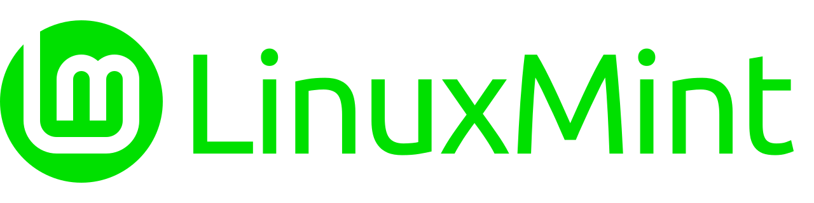
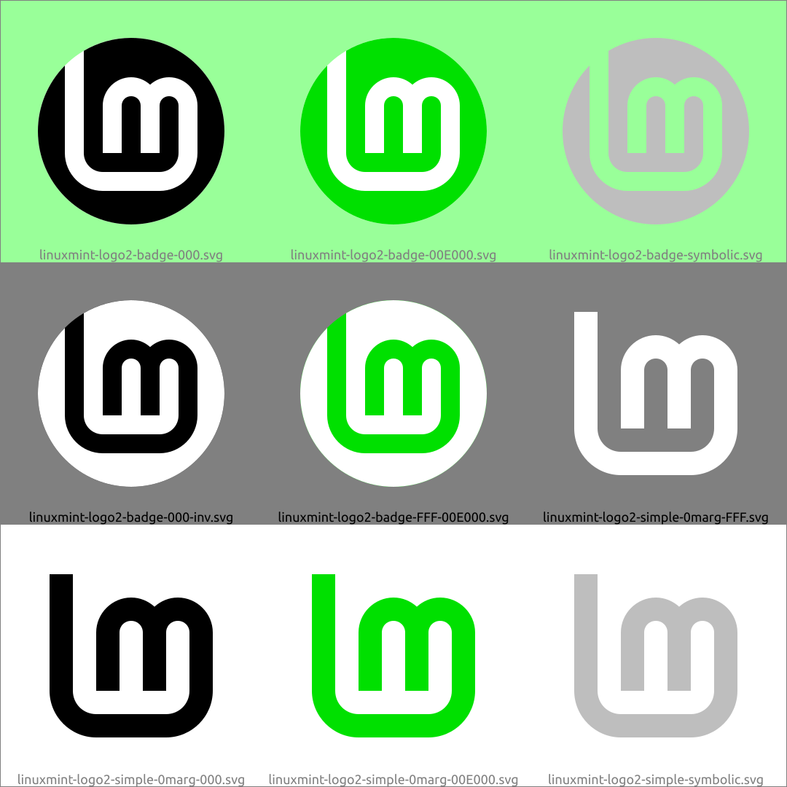
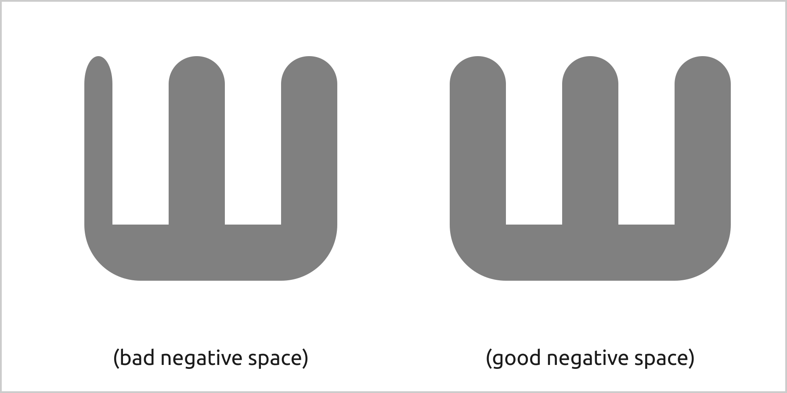

### The official LinuxMint logo subtly redesigned with a few pixels of difference

## Download
[Download ZIP here](https://github.com/SebastJava/linuxmint-logo/archive/refs/heads/master.zip) (OR click on top-right green button "Code" and then click on "Download ZIP".)

## SVG or PNG ?
Please prefer the SVG source files. The PNG files are there for low resolution previews only. The SVG format is a vector based format, it is always perfect at any size and can be edited easily. On the other hand, sometimes I find it much safer to export these images to PNG format to ensure they are always displayed the same and there is no bad interpretations. But then, when using PNG formats, it is better to ensure you set the exact with X height size in pixels to avoid some possibly bad re-scaling. Or just make it at higher resolutions, but this is heavy on the internet transfer.

Use Inkscape to open one of these SVG files and change the colors or do any other editing. Also, i recommend using Inkscape for your PNG exports. I am currently using Inkscape 1.0.2, installed from PPA. If you want to edit those files in Inkscape, **you may need to ungroup or unlock some elements.**

## Differences
* There isn't as many versions as in the official `/usr/share/icons/hicolor/scalable/apps/linuxmint-*`. Things are thus more constant, and simpler.
* All versions are perfect squares or perfect circles, without any stretching. To achieve this, the "L" is a little taller, which makes sense since this letter is indeed taller in everyday typography: "Lm".
* I didn't want the top of the "L" to be too close to the edge of the circle, but I also didn't want the logo to be too small. So, I took another path: an infinite "L"...
* I am disappointed to sometimes find older versions of the logo still in use. These versions do not have the same spacing everywhere. It's a shame, because this new logo attracts with its good use of negative space. Please see my illustration to understand this. There is an underlying positive influence there...
* All widths and spacings are equal and are round numbers.
* logo-name = `linuxmint-logo2-name-COLOR.svg`: created using manual kerning and precise alignments, and the Ubuntu font got converted to vectors for guaranteed universality. But the editable text is still there, on a separate invisible layer in Inkscape.

## Color
The official color is yet to be determined, as far as I know. Well, not exactly. Clem once said he wants to keep a 90° hue (HSL color representation). That's a yellow-green. Saturation and brightness are still to be determined. Take note that in parallel with that, the colors of the Mint-Y theme are also to be redefined, as of spring 2021. And that includes the Mint green. But the logo does not have to get the exact same color as the Mint-Y theme. The logo color could be more vibrant, having some bright color that stands out. But i am having troubles with this official 90° hue, this yellow-green. This color is so bright, it needs to be heavily subdued, and then i don't like it. So i went totally off-track and suggested my own color(s) here. You can easily change it in Inkscape, anyway.

## History
What follows is my version of the story, of course. And i am trying to make it a short story.

A competition was held to define the Linux Mint logo. The logo proposed by Carlos Porto won the vote. That was back in year 2007. Ten years later, I installed Linux Mint on my little Netbook. I didn't like the logo that appeared on my screen. There was too many details and I didn't find much sense in it.

I set out to redraw this logo from scratch, on a blank page, forgetting all those annoying details. I've searched the web and saw others have tried it before me. So I have the idea to share my creation. I'm afraid I won't be accepted so I set out to redo a logo similar to the official logo, but in a simple and flat version. I present this on the LM forums: [VOTE! Mint-Y-LOGO... A New Version Of The Linux Mint Logo!](Https://forums.linuxmint.com/viewtopic.php?f=19&t=280401)

In the comments received, among those that are positive, Reaccion Raul suggested a simpler background, if any, or just the "Lm". And then Joan_2018 suggested doing that in black and white, without colors. And then, later, Clem presented us with a simplified logo with different backgrounds, mostly circular background shapes. So this logo is the result of a collective work, in my humble opinion. I'm glad Clem went further than me, completely forgetting the old background. I approve and continue on this path, but with my personal touch.

In fact, this is a late reshuffle. I figured this was my own repo, so I had to go all out with my personal preferences. Everything has been completely reworked during the month of April 2021, starting from my original drawing from October 2018.